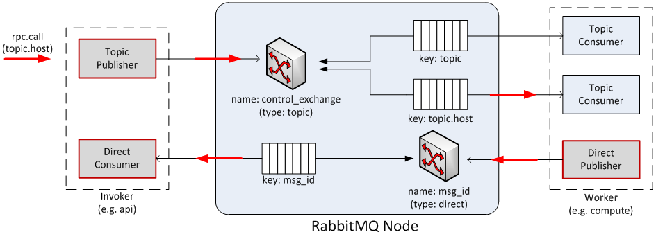
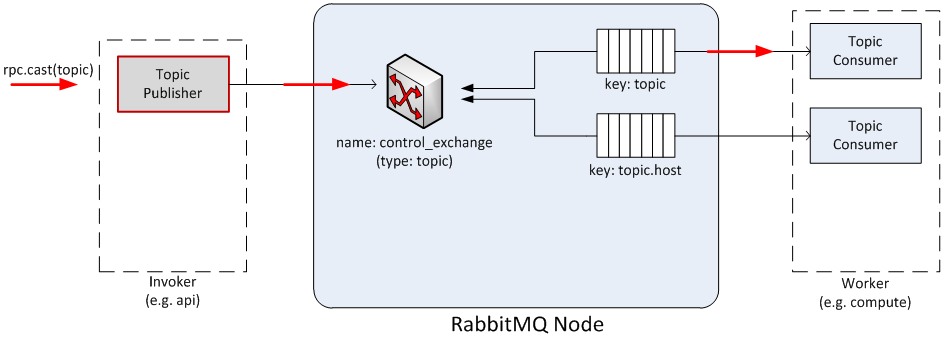

# Inside Openstack RPC

> 
>
> `>>> page under construction <<<`

This page briefly introduce openstack rpc's logic.

For more detailed information please refer to [Office Document](http://docs.openstack.org/developer/nova/devref/rpc.html).

## RPC Calls

The diagram below shows the message flow during an `rpc.call` operation:



*  a Topic Publisher is instantiated to send the message request to the queuing system; immediately before the publishing operation, a Direct Consumer is instantiated to wait for the response message.
*  once the message is dispatched by the exchange, it is fetched by the Topic Consumer dictated by the routing key (such as .topic.host.) and passed to the Worker in charge of the task.
*  once the task is completed, a Direct Publisher is allocated to send the response message to the queuing system.
*  once the message is dispatched by the exchange, it is fetched by the Direct Consumer dictated by the routing key (such as .msg_id.) and passed to the Invoker.


## RPC Casts    

The diagram below the message flow during an `rpc.cast` operation:



*  A Topic Publisher is instantiated to send the message request to the queuing system.
*  Once the message is dispatched by the exchange, it is fetched by the Topic Consumer dictated by the routing key (such as .topic.) and passed to the Worker in charge of the task.


## RPC implementation code in nova
> nova / nova / rpc / amqp.py

```python
def multicall(context, topic, msg, timeout, connection_pool):
	"""Make a call that returns multiple times."""
	# Can't use 'with' for multicall, as it returns an iterator
	# that will continue to use the connection. When it's done,
	# connection.close() will get called which will put it back into
	# the pool
	LOG.debug(_('Making asynchronous call on %s ...'), topic)
	msg_id = uuid.uuid4().hex
	msg.update({'_msg_id': msg_id})
	LOG.debug(_('MSG_ID is %s') % (msg_id))
	pack_context(msg, context)

	conn = ConnectionContext(connection_pool)
	wait_msg = MulticallWaiter(conn, timeout)
	conn.declare_direct_consumer(msg_id, wait_msg)
	conn.topic_send(topic, msg)
	return wait_msg


def call(context, topic, msg, timeout, connection_pool):
	"""Sends a message on a topic and wait for a response."""
	rv = multicall(context, topic, msg, timeout, connection_pool)
	# NOTE(vish): return the last result from the multicall
	rv = list(rv)
	if not rv:
		return
	return rv[-1]


def cast(context, topic, msg, connection_pool):
	"""Sends a message on a topic without waiting for a response."""
	LOG.debug(_('Making asynchronous cast on %s...'), topic)
	pack_context(msg, context)
	with ConnectionContext(connection_pool) as conn:
		conn.topic_send(topic, msg)
```

